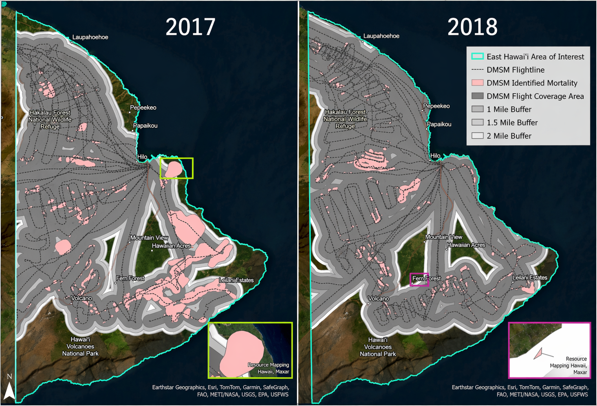
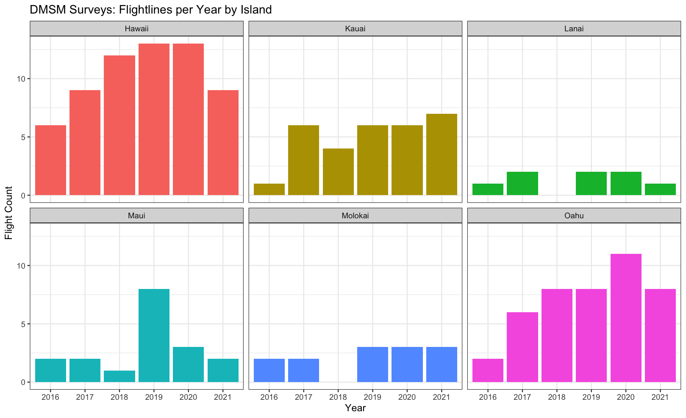

# Suspect Rapid 'Ōhi'a Death Detection Using Satellite Imagery and Deep Learning

## Overview

The J-STARS project focuses on detecting and monitoring Rapid 'Ōhi'a Death (ROD) using satellite imagery and deep learning. The project employs a spatio-temporal deep learning approach combining Sentinel-1 SAR data with advanced temporal modeling to identify and track ROD outbreaks across the Hawaiian Archipelago.

**Study Area:** DMSM flightlines
**Temporal Range:** 6-year longitudinal dataset (2016-2021)
**Output Classes:** 2 classes (healthy forest, ROD mortality)

---

## Problem Statement: Limitations of DMSM Surveys

Current ROD surveillance relies on **Digital Mobile Sketch Mapping (DMSM)** aerial surveys, which have several critical limitations:

### Geographic Bias

- 
- Visibility-constrained mapping creates systemic geographic bias
- Flight line buffer limited to 1 mile (up to 2 miles with good visibility)
- Areas outside surveyors' field of view remain unsampled ("geographic information desert")

### Subjective Boundaries

- 
- No standardized protocol for polygon boundaries
- "No specified rule regarding how far digitized polygons were from target trees"
- Freeform polygons drawn to "best of analysts' ability"
- High inter-observer variability—two trained professionals can produce different labels
- Surveyor experience varies across islands and organizations
- Speed of flight and experience level compound subjectivity

### Temporal Limitations

- 
- Limited annual flightline counts per island

### Key Citation

> _"Although aerial sketch surveys are invaluable to forest health monitoring, human error can cause high variability in data collection."_ — Odachi (2024)

---

## Satellite Sensor Comparison

### Coarse Resolution Satellites


| Sensor         | Type         | Resolution | Revisit Cycle | Limitations                                                          |
| -------------- | ------------ | ---------- | ------------- | -------------------------------------------------------------------- |
| **Sentinel-1** | SAR (C-band) | 10m        | 7-13 days     | C-band penetrates top canopy; requires substantial structural change |
| **Sentinel-2** | Optical      | 10m        | 5 days        | Blocked by cloud cover                                               |

- **Strengths:** Publicly available, high temporal resolution, island-wide coverage
- **Weaknesses:** Cannot capture individual detections; limited to large-scale outbreaks

### High Resolution Satellites


| Sensor          | Type         | Resolution | Revisit Cycle | Availability |
| --------------- | ------------ | ---------- | ------------- | ------------ |
| **Capella**     | SAR (X-band) | 1.2m       | 1-2 hours     | Not public   |
| **WorldView-2** | Optical      | 0.5m       | 1.1 days      | Not public   |

- **Strengths:** Crown-level visualization, X-band reflects off canopy (subtle structural change)
- **Weaknesses:** Complex preprocessing, limited access

---

## Model Architecture

### Overview


The model follows an **Encoder-Decoder architecture** with temporal aggregation:

```
ResNet-50 (spatial) → ConvLSTM (temporal) → U-Net (decoder)
```

### Detailed Architecture

#### 1. Spatial Encoder (`spatial_encoder.py`)

- **Base Model:** ResNet-50
- **Pretraining:** SSL4EO-S12 MoCo-v2 weights
- **Input Channels:** 2 (VV, VH) or 3 (VV, VH, RVI)
- **Output Features (4 scales):**
  - Layer 1: (B, 256, H/4, W/4)
  - Layer 2: (B, 512, H/8, W/8)
  - Layer 3: (B, 1024, H/16, W/16)
  - Layer 4: (B, 2048, H/32, W/32)

**Key Features:**

- First convolutional layer adapted for SAR input (2 channels VV and VH)
- Pretrained weights loaded with compatible channel mapping
- Supports checkpoint loading from SSL4EO-S12

#### 2. Temporal Encoder (`temporal_encoder.py`)

- **Architecture:** ConvLSTM
- **Input:** (T, B, C, H, W) temporal sequence at each spatial scale
- **Components:**
  - `ConvLSTMCell`: Single timestep processing with input/forget/output/cell gates
  - `ConvLSTMStack`: Processes entire temporal sequence
  - `SpatioTemporalEncoder`: Orchestrates ResNet + ConvLSTM across scales

**Temporal Processing:**

- Applies ConvLSTM at each of 4 spatial scales
- Aggregates temporal information into per-scale feature maps
- Optional sinusoidal day-of-year (DoY) encoding injection

#### 3. Temporal Encoding (`temporal_encoding.py`)

- **Purpose:** Encodes seasonal information via day-of-year
- **Method:** Sinusoidal positional encoding
- **Dimension:** Configurable (default 32)
- **Injection:** Concatenated to spatial features before ConvLSTM

#### 4. U-Net Decoder (`decoder.py`)

- **Architecture:** U-Net with skip connections
- **Input:** 4 temporally-aggregated feature maps from encoder
- **Upsampling Path:**
  - H/32 → H/16 (ConvTranspose2d + ConvBlock)
  - H/16 → H/8 (skip connection from encoder)
  - H/8 → H/4 (skip connection from encoder)
  - H/4 → H/2
  - H/2 → H (final resolution)
- **Output:** (B, 2, H, W) logits for binary segmentation

**Decoder Blocks:**

- Double convolution: Conv3x3 + BN + ReLU × 2
- Optional dropout (configurable, default 0.2)

#### 5. Full Model (`s1_change_detector.py`)

```
class S1ChangeDetector:
    Input:  (B, T, C, H, W) + optional DoY tensor
    Output: (B, 2, H, W) logits

    Components:
    - encoder: SpatioTemporalEncoder
    - temporal_encoding: SinusoidalDoYEncoding (optional)
    - decoder: UNetDecoder
```

### Model Comparison Results

| Loss Function | Mean IoU | F1 Mortality | IoU Mortality |
| ------------- | -------- | ------------ | ------------- |
| Focal & Dice  | 0.4063   | 0.3857       | 0.2389        |
| BCE & Dice    | 0.4176   | 0.3527       | 0.2141        |


**Legend:**

- **Red** = Change/mortality (Ground Truth / Prediction)
- **Dark** = Background (Ground Truth / Prediction)
- **Gray** = Ignore/nodata (Ground Truth / Prediction)
- **Green** = True positive (Error map: correct)
- **Orange** = False positive (Error map: over-prediction)
- **Purple** = False negative (Error map: under-prediction)

---

## Data Sources

### Remote Sensing Data

#### Sentinel-1 SAR

- **Orbits:** Three relative orbits (22, 95, 124)
- **Mode:** Ascending
- **Repeat Cycle:** 12 days
- **Channels:**
  - VV: Co-polarized backscatter (canopy structure, density)
  - VH: Cross-polarized backscatter (volume scattering, structural complexity)
  - RVI: Radar Vegetation Index (optional)

**Physical Basis:**

- Radar sensors visualize changes in dielectric content of suspect ROD
- C-band penetrates top layer of canopy
- Requires substantial structural change for detection
- **Important:** No spectral or radar signature of ROD confirmed; detections require qPCR verification

### Ground Truth

#### DMSM Labeled Dataset

- **Method:** Digital Mobile Sketch Mapping helicopter surveys
- **Frequency:** Bi-monthly
- **Visibility Range:** 1-2 miles from flightline
- **Labels:** Binary (present/absent) and ordinal severity levels
- **Protocol:** Areas with ≥10 suspect trees are outlined using freeform polygons

**Caveats:**

- Human error can cause high variability in data collection
- Inter-observer variability across different surveyors
- Each island has different survey teams with varying experience levels

#### Chip Specifications

- **Count:** 14,000
- **Resolution:** 10m per pixel
- **Size:** 256 × 256 pixels (2.56 km × 2.56 km per chip)
- **Temporal Dimension:** 6 timesteps per chip
- **Balance:** 3:1 positive (ROD) to negative (healthy) ratio

### Negative Sample Logic

Negative samples constrained using NLCD TCC with 10% threshold to ensure model distinguishes ROD from healthy forest rather than non-forested land.

---

## Data Processing

### Dataset Loader (`dataset.py`)

**Key Features:**

- Temporal reversal (chips saved newest-first, model expects oldest-first)
- NaN handling and filling
- Day-of-year computation
- Nodata masking (SAR nodata merged into ignore_index=255)

### Augmentation Pipeline

Applied to every training patch:

1. **Random crop + resize** (0.8-1.0 scale)
2. **Random horizontal flip** (50% probability)
3. **Random vertical flip** (50% probability)
4. **Random 90° rotation** (uniform over 0-3 rotations)
5. **SAR color jitter:**
   - Brightness offset: ±2 dB
   - Contrast scaling: 0.8-1.2
6. **Gaussian blur** (30% probability, σ ∈ [0.5, 1.5])

---

## Training

### Training Script (`train.py`)

**Usage:**

```bash
python train.py --manifest manifest.csv --checkpoint B2_rn50_moco_0099.pth --epochs 50
```

### Key Training Parameters

| Parameter                 | Default | Description                           |
| ------------------------- | ------- | ------------------------------------- |
| `--epochs`                | 50      | Number of training epochs             |
| `--batch-size`            | 4       | Training batch size                   |
| `--lr`                    | 2e-6    | Global learning rate                  |
| `--seed`                  | 42      | Random seed for reproducibility       |
| `--freeze-epochs`         | 10      | Epochs to freeze encoder layers 1-2   |
| `--temporal-encoding-dim` | 32      | DoY encoding dimension                |
| `--loss`                  | ce_dice | Loss function (ce_dice or focal_dice) |

### Loss Functions (`losses.py`)

#### Combined Cross-Entropy + Dice Loss

```python
loss = ce_weight * CrossEntropy + dice_weight * DiceLoss
```

**Features:**

- Per-class weights (default: [1.0, 2.0] for healthy/mortality)
- Label smoothing (default 0.05)
- Dice loss for segmentation optimization

#### Combined Focal + Dice Loss

```python
loss = focal_weight * FocalLoss + dice_weight * DiceLoss
```

**Features:**

- Focal loss with configurable gamma (default 2.0)
- Focuses on hard examples
- Combined with Dice for spatial coherence

### Optimizer and Scheduler

- **Optimizer:** AdamW (weight decay 1e-2)
- **Scheduler:** CosineAnnealingLR (decays from initial LR to 0)
- **Freeze Schedule:** Lower encoder layers frozen for first N epochs

### Training Features

- **Weighted Random Sampler:** Ensures 50/50 balance across batches
- **Mixed Precision Training:** Uses torch.amp.autocast and GradScaler
- **Early Stopping:** Based on mortality IoU improvement
- **Collapse Detection:** Warns if max_pred_prob < 0.5

---

## Evaluation Metrics (`metrics.py`)

### ChangeDetectionMetrics

**Computed Metrics:**

- **Per-class:**
  - IoU (Intersection over Union)
  - F1 Score
  - Precision
  - Recall
- **Overall:**
  - Mean IoU
  - Mean F1
  - Accuracy
- **Diagnostic:**
  - `max_pred_prob`: Collapse detection signal

---

## Spatial Analysis Methods

### Indicator Semivariogram

### Kriging Comparison

## Project Structure

```
J-STARS/
├── ROD-WEB-APP/          # Web application for ROD detection visualization
├── ROD-ANALYSIS/         # Spatial analysis methods (GWR, Moran's I, Join Count)
│   ├── Geographically Weighted Regression (GWR).md
│   ├── Spatial Dependency Analysis with DMSM.md
│   └── Semivariance with GAO.md
├── ROD-COLLECTION/        # Data collection processes
├── ROD-PROCESSING/       # Data processing pipelines (chips, flightlines)
│   ├── attachments/
│   │   ├── flightlines/
│   │   ├── negative_patches/
│   │   ├── positive/
│   │   └── tcc/
│   ├── chip_sentinel1.py
│   ├── negative.py
│   └── positive.py
├── ROD-TRAINING/         # Model training scripts and implementations
│   ├── models/
│   │   ├── decoder.py
│   │   ├── s1_change_detector.py
│   │   ├── spatial_encoder.py
│   │   ├── temporal_encoder.py
│   │   └── temporal_encoding.py
│   ├── dataset.py
│   ├── losses.py
│   ├── metrics.py
│   └── train.py
├── ROD-EVALUATION/       # Model evaluation and metrics
└── Documentation/         # Project notes and references
    ├── Links.md
    ├── Neural Operator.md
    ├── Study Area and Data Acquisition.md
    ├── High Resolution Satellite Imagery.md
    ├── Multi Modal Approach.md
    ├── DMSM Labeled Dataset.md
    └── [Additional documentation files]
```

---

## Key Insights from Literature

### ROD Disease Progression

- **No predictable temporal pattern:** 3-4 month red-to-brown peak to skeleton
- **Pulse of mortality** with no rhyme or reason
- **Possible triggers:** Big wind storm events

### Survey Limitations

- DMSM survey accuracy decreases near flightline boundaries
- Use 1-mile buffer for valid predictions
- Flightline proximity can be used as covariate

### Future Directions

- **Alpha Earth Embeddings**
- \*\*Clim
- **High Resolution** with $\text{3m}^\text{2}$ X-band TerraXSAR near Kilauea volcano
  - **Crown level detections** with GAO points and confirmed mortality in DMSM
- **Positional embeddings** (if using transformer architecture)
- **Fenceline dataset** available but limited (publication pending on healing after repair)
  - Likely difficult to get approval

---

## References

### Papers and Resources

1. **Odachi, N.** (2024). "High-Resolution Satellite Imagery: An Alternative Method for Detection and Monitoring of Rapid 'Ōhi'a Death in Hawai'i." Publicationslist.org, vol. 14, no. 6.
2. **O'Neill, C. M. and Peters, S. T.** (2026). "Tracking the Spread of Rapid Ōhi'a Death Using Synthetic Aperture Radar." AIAA SCITECH 2026 Forum.
3. **Leatherman, L. et al.** (2023). Rapid 'Ōhi'a Death (ROD) Mortality in Hawai'i: Method Assessment and Workflow Development.
4. **USDA** (2025). "Digital Mobile Sketch Mapping (DMSM)."
5. **NASA** (2021). "Synthetic Aperture Radar | NASA Earthdata." NASA Earthdata.
6. **Ronneberger, O., Fischer, P., and Brox, T.** (2015). "U-Net: Convolutional Networks for Biomedical Image Segmentation." arXiv.org.
7. **Shi, X. et al.** (Convolutional LSTM Network: A Machine Learning Approach for Precipitation Nowcasting."
8. **Papadomanolaki, M. et al.** (2019). "Detecting Urban Changes with Recurrent Neural Networks from Multitemporal Sentinel-2 Data." arXiv.org.

### Template and Model Sources

- **IEEE GRSS J-STARS Call for Papers:** [Template](https://www.grss-ieee.org/wp-content/uploads/2025/09/JSTARS_CfP_Templatev3.pdf)
- **Base Model:** [UNetLSTM](https://github.com/mpapadomanolaki/UNetLSTM.git)
- **Pretraining:** [SSL4EO-S12 MoCo-v2](https://github.com/zhu-xlab/SSL4EO-S12)

### Expert Contacts

- **[Kevin Lane](https://geohai.org/members/kevin-lane.html)** Geospatial Machine Learning
- **[Zhongying Wang](https://www.colorado.edu/geography/zhongying-stephen-wang):** Geo AI, Machine Learning
- **[Sepideh Jalayer](https://www.colorado.edu/geography/sepideh-jalayer):** Remote Sensing, Geo AI
- **[Nia'a Odachi](https://hilo.hawaii.edu/sdav/people.php):** Rapid ‘Ōhi‘a Death Research Specialist
- **[Ryan Perroy](https://hilo.hawaii.edu/sdav/people.php):** Principal Investigator
- **Brian Tucker:** DMSM methodology, limitations, and flightline data
- **Nick Vaughn:** GAO high-accuracy point measurements for calibration

---

## Quick Start

### Training the Model

```bash
cd ROD-TRAINING
python train.py --manifest manifest.csv \
               --checkpoint B2_rn50_moco_0099.pth \
               --epochs 50 \
               --batch-size 4 \
               --loss ce_dice
```

### Generating Prediction Mask

```python
from models import S1ChangeDetector
import torch

# Load model
model = S1ChangeDetector(
    checkpoint_path="B2_rn50_moco_0099.pth",
    num_classes=2
)
model.eval()

# Forward pass
with torch.no_grad():
    logits = model(chip, doy)
    probs = torch.softmax(logits, dim=1)
    predictions = probs.argmax(dim=1)
```

---

## License and Acknowledgments

This project builds upon foundational work in remote sensing of forest health and deep learning for change detection. We acknowledge:

- USDA Forest Service for DMSM data
- Copernicus Sentinel program for open SAR data
- SSL4EO-S12 for pretraining weights
- The Hawaiian forest conservation community for ground truth verification
